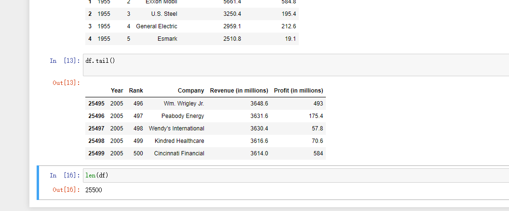

# homework3

## 创建一个新的Notebook

在anaconda promote 中输入jupyter notebook


会弹出如下页面


点击python3之后：跳转到如下页面：


这里有两个关键元素cell和kernal

- cell: 文本或者代码执行单元，由kernel执行。
- kernel: 计算引擎，执行cell的文本或者代码，本文基于Python 3 ipykernel引擎。


cell
主要包含两种类型的cell：

代码cell：包含可被kernel执行的代码，执行之后在下方显示输出。
Markdown cell：书写Markdown标记语言的cell。
试着输入一行代码，查看执行效果：


代码执行之后，cell左侧的标签从`In [ ]` 变成了 `In [1]`。`In`代表输入，`[]`中的数字代表kernel执行的顺序，而`In [*]`则表示代码cell正在执行代码。以下例子显示了短暂的`In [*]`过程。

```python
import time
time.sleep(3)
```


### cell模式

有两种模式，编辑模式（edit mode）和命名模式（command mode）

- 编辑模式：enter健切换，绿色轮廓
- 命令模式：esc健切换，蓝色轮廓


按esc之后变成蓝色：


快捷键
使用Ctrl + Shift + P命令可以查看所有Notebook支持的命令。

在命名模式下，一些快捷键将十分有帮助

上下键头可以上下cell移动
A 或者 B在上方或者下方插入一个cell
M 将转换活动cell为Markdown cell
Y 将设置活动cell为代码 cell
D+D（两次）删除cell
Z 撤销删除
H 打开所有快捷键的说明
在编辑模式，Ctrl + Shift + -将以光标处作为分割点，将cell一分为二。


Kernel
每个notebook都基于一个内核运行，当执行cell代码时，代码将在内核当中运行，运行的结果会显示在页面上。Kernel中运行的状态在整个文档中是延续的，可以跨越所有的cell。这意思着在一个Notebook某个cell定义的函数或者变量等，在其他cell也可以使用。例如：


以下教程将分两个例子实现基本的Notebook编写，包括简单的[Python程序](https://so.csdn.net/so/search?q=Python程序&spm=1001.2101.3001.7020)和Python数据分析的例子。首先，重命名文档，更改`Untitled`并输入相关文件名。注意，在写作过程中，常用`Ctrl + S`保存已有的文档。

python快速排序：

```python

def sort(a,l,r):
    if l >= r:return
    # 1、确定分界点
    x = a[(l + r) // 2]
    i, j = l - 1, r + 1
    while i < j :
        i+=1
        j-=1
        # 当左边区间的值放小于x，指针不断右移；右边的相反
        while a[i] < x :
            i += 1
        while a[j] > x :
            j -= 1
        # 2、调整区间，使得左边区间是<=x的数，右边区间是>=x的数
        # 移动过后，如果i还是小于j，说明左边或者右边有逆向数据，所以交换。
        if i < j:
            a[i], a[j] = a[j], a[i]
    # 3、递归处理左右两个区间   
    sort(a,l,j)
    sort(a,j+1,r)


#sort(a, 0, n-1)
#print(' '.join(map(str, a)))


```

在notebook上执行：


## 数据分析的例子(使用pandas)


pandas用于数据处理，matplotlib用于绘图，seaborn使绘图更美观。第一行不是python命令，而被称为line magic。%表示作用与一行，%%表示作用于全文。此处%matplotlib inline 表示使用matlib画图，并将图片输出。

随后，加载数据集。
```python
df = pd.read_csv('fortune500.csv')

```

因为还没有将数据集加载到notebook出现如下错误：


接下来将数据集导入到jupyter notebook


重新执行导入语句：


## 检查数据集

上述代码执行生成的df对象，是pandas常用的数据结构，称为`DataFrame`，可以理解为数据表。

```python
df.head()
```


```python
df.tail()
```


对数据属性列进行重命名，以便在后续访问

```python
df.columns = ['year', 'rank', 'company', 'revenue', 'profit']
```


接下来，检查数据条目是否加载完整。

```python
len(df)
```



从1955至2055年总共有25500条目录。然后，检查属性列的类型。

```python
df.dtypes
```


其他属性列都正常，但是对于profit属性，期望的结果是float类型，因此其可能包含非数字的值，利用正则表达式进行检查。

```python
non_numberic_profits = df.profit.str.contains('[^0-9.-]')
df.loc[non_numberic_profits].head()

```


确实存在这样的记录，profit这一列为字符串，统计一下到底存在多少条这样的记录。

```python
len(df.profit[non_numberic_profits])
```


总体来说，利润（profit）列包含非数字的记录相对来说较少。更进一步，使用直方图显示一下按照年份的分布情况。

```python
bin_sizes, _, _ = plt.hist(df.year[non_numberic_profits], bins=range(1955, 2006))
```


可见，单独年份这样的记录数都少于25条，即少于4%的比例。这在可以接受的范围内，因此删除这些记录。

```python
df = df.loc[~non_numberic_profits]
df.profit = df.profit.apply(pd.to_numeric)
```


再次检查数据记录的条目数。

```python
len(df)
```


可见，上述操作已经达到清洗无效数据记录的效果。


## 使用matplotlib进行绘图

接下来，以年分组绘制平均利润和收入。首先定义变量和方法。

```python
group_by_year = df.loc[:, ['year', 'revenue', 'profit']].groupby('year')
avgs = group_by_year.mean()
x = avgs.index
y1 = avgs.profit
def plot(x, y, ax, title, y_label):
    ax.set_title(title)
    ax.set_ylabel(y_label)
    ax.plot(x, y)
    ax.margins(x=0, y=0)

```

绘图：

```python
fig, ax = plt.subplots()
plot(x, y1, ax, 'Increase in mean Fortune 500 company profits from 1955 to 2005', 'Profit (millions)')

```


看起来像指数增长，但是1990年代初期出现急剧的下滑，对应当时经济衰退和网络泡沫。再来看看收入曲线。

```python
y2 = avgs.revenue
fig, ax = plt.subplots()
plot(x, y2, ax, 'Increase in mean Fortune 500 company revenues from 1955 to 2005', 'Revenue (millions)')
```


公司收入曲线并没有出现急剧下降，可能是由于财务会计的处理。对数据结果进行标准差处理。


```python
def plot_with_std(x, y, stds, ax, title, y_label):
    ax.fill_between(x, y - stds, y + stds, alpha=0.2)
    plot(x, y, ax, title, y_label)
fig, (ax1, ax2) = plt.subplots(ncols=2)
title = 'Increase in mean and std Fortune 500 company %s from 1955 to 2005'
stds1 = group_by_year.std().profit.values
stds2 = group_by_year.std().revenue.values
plot_with_std(x, y1.values, stds1, ax1, title % 'profits', 'Profit (millions)')
plot_with_std(x, y2.values, stds2, ax2, title % 'revenues', 'Revenue (millions)')
fig.set_size_inches(14, 4)
fig.tight_layout()

```


可见，不同公司之间的收入和利润差距惊人，那么到底前10%和后10%的公司谁的波动更大了？此外，还有很多有价值的信息值得进一步挖掘。


分享Notebooks
分享Notebooks通常来说一般存在两种形式：一种向本文一样以静态非交互式分享（html,markdown,pdf等）；另外一种通过Git版本工具或者Google Colab进行协同开发

分享之前的工作
分享的Notebooks应包括代码执行的输出，要保证执行的结果符合预期，需完成以下几件事：

点击"Cell > All Output > Clear"
点击"Kernel > Restart & Run All"
等待所有代码执行完毕
这样做的目的使得Notebook不含有中间的执行结果，按照代码执行的顺序，产生稳定的结果。


## 导出Notebooks

使用"File > Download as"可以以多种格式导出Notebooks，例如：html, pdf, markdown文档等。如果希望以协同方式共享.ipynb，则可以借助相关的在线平台，如[Github](https://github.com/)或者[Google Colab](https://colab.research.google.com/)。


## Jupyter Notebook扩展工具

Jupter Notebook的扩展工具(extensions)可以提供丰富的附加功能，例如代码补全、内容目录、变量检查等。本节演示如何安装扩展工具和启用代码补全功能。
首先Anaconda Navigator中启动命令行终端，


在弹出的终端中依次输入下面4条命令，注意要耐心等待命令执行完成。

```
pip install jupyter_contrib_nbextensions

jupyter contrib nbextension install --user

pip install jupyter_nbextensions_configurator

jupyter nbextensions_configurator enable --user

```

等待最后一条指令完成即可。完成之后，重新打开Jupyter Notebook启动页面，可以看到：


呃 好像没实现代码补全所需要的扩展工具--

